# מבנה קטגוריות הכנסות והוצאות - Phi (φ)

## תרשים Mermaid - מבנה מלא

```mermaid
graph TB
    Root[מערכת קטגוריות פיננסית]
    
    %% ענף הכנסות
    Income[הכנסות<br/>income_sources]
    Root --> Income
    
    Income --> IS1[משכורת<br/>salary]
    Income --> IS2[עצמאי<br/>freelance]
    Income --> IS3[עסק<br/>business]
    Income --> IS4[הכנסה פסיבית<br/>passive]
    Income --> IS5[אחר<br/>other]
    
    IS1 --> IS1_1[משכורת ברוטו<br/>gross_salary]
    IS1 --> IS1_2[משכורת נטו<br/>net_salary]
    IS1 --> IS1_3[ניכוי מס<br/>tax_deducted]
    IS1 --> IS1_4[ביטוח לאומי<br/>social_security]
    IS1 --> IS1_5[פנסיה עובד<br/>pension_employee]
    IS1 --> IS1_6[פנסיה מעסיק<br/>pension_employer]
    
    IS2 --> IS2_1[סטטוס מע״מ<br/>vat_status]
    IS2 --> IS2_2[כולל מע״מ<br/>includes_vat]
    IS2 --> IS2_3[ניכוי מס במקור<br/>withholding_tax]
    
    IS3 --> IS3_1[הכנסה משולבת<br/>hybrid]
    IS3 --> IS3_2[חלק שכיר<br/>hybrid_salary_part]
    IS3 --> IS3_3[חלק עצמאי<br/>hybrid_freelance_part]
    
    IS4 --> IS4_1[הכנסה מהון<br/>capital_gain]
    IS4 --> IS4_2[קצבאות<br/>allowance]
    IS4 --> IS4_3[פטור ממס<br/>tax_exempt]
    
    %% ענף הוצאות
    Expenses[הוצאות<br/>expense_categories]
    Root --> Expenses
    
    %% קבוצת דיור
    Expenses --> EG1[דיור<br/>housing]
    EG1 --> E1[ארנונה למגורים<br/>fixed]
    EG1 --> E2[ארנונה לעסק<br/>fixed]
    EG1 --> E3[חשמל לבית<br/>fixed]
    EG1 --> E4[חשמל לעסק<br/>fixed]
    EG1 --> E5[מים<br/>fixed]
    EG1 --> E6[גז<br/>fixed]
    EG1 --> E7[ועד בית<br/>fixed]
    EG1 --> E8[שכירות למגורים<br/>fixed]
    EG1 --> E9[שכירות משרד<br/>fixed]
    EG1 --> E10[משכנתא<br/>fixed]
    EG1 --> E11[תיקונים בבית<br/>fixed]
    EG1 --> E12[אחזקת מבנה<br/>fixed]
    EG1 --> E13[ניקיון בית<br/>variable]
    EG1 --> E14[ניקיון עסק<br/>fixed]
    EG1 --> E15[גינון<br/>fixed]
    EG1 --> E16[טכנאים<br/>fixed]
    EG1 --> E17[ציוד לבית<br/>variable]
    EG1 --> E18[רהיטים<br/>special]
    EG1 --> E19[מכשירי חשמל<br/>special]
    
    %% קבוצת תקשורת
    Expenses --> EG2[תקשורת<br/>communication]
    EG2 --> E20[אינטרנט ביתי<br/>fixed]
    EG2 --> E21[טלפונים ניידים<br/>fixed]
    EG2 --> E22[טלפונים עסקיים<br/>fixed]
    EG2 --> E23[טלוויזיה<br/>fixed]
    
    %% קבוצת ביטוחים
    Expenses --> EG3[ביטוחים<br/>insurance]
    EG3 --> E24[ביטוח חיים<br/>fixed]
    EG3 --> E25[ביטוח בריאות<br/>fixed]
    EG3 --> E26[ביטוח אובדן כושר<br/>fixed]
    EG3 --> E27[ביטוח רכב<br/>fixed]
    EG3 --> E28[ביטוח עסק<br/>fixed]
    EG3 --> E29[ביטוח דירה<br/>fixed]
    EG3 --> E30[ביטוח פנסיה<br/>fixed]
    EG3 --> E31[ביטוח אחריות<br/>fixed]
    EG3 --> E32[ביטוח צד ג׳<br/>fixed]
    EG3 --> E33[ביטוח חובה לרכב<br/>fixed]
    EG3 --> E34[ביטוח חיות מחמד<br/>fixed]
    EG3 --> E35[ביטוח בריאות עובדים<br/>fixed]
    
    %% קבוצת פיננסים
    Expenses --> EG4[פיננסים<br/>finance]
    EG4 --> E36[הלוואות בנקאיות<br/>fixed]
    EG4 --> E37[הלוואות עסקיות<br/>fixed]
    EG4 --> E38[הלוואות פנסיוניות<br/>fixed]
    EG4 --> E39[הלוואות חוץ בנקאיות<br/>fixed]
    EG4 --> E40[הלוואה מכרטיס אשראי<br/>fixed]
    EG4 --> E41[עמלות בנק<br/>variable]
    EG4 --> E42[דמי ניהול עסקי<br/>fixed]
    EG4 --> E43[דמי ניהול פרטי<br/>fixed]
    
    %% קבוצת רכב
    Expenses --> EG5[רכב ותחבורה<br/>transportation]
    EG5 --> E44[תחבורה ציבורית<br/>variable]
    EG5 --> E45[דלק<br/>variable]
    EG5 --> E46[חניה<br/>variable]
    EG5 --> E47[כבישי אגרה<br/>variable]
    EG5 --> E48[טיפולי רכב<br/>fixed]
    EG5 --> E49[טסט לרכב<br/>fixed]
    EG5 --> E50[רישוי רכב<br/>fixed]
    
    %% קבוצת משרד
    Expenses --> EG6[משרד וציוד<br/>office]
    EG6 --> E51[ציוד משרדי<br/>variable]
    EG6 --> E52[מחשבים וציוד<br/>special]
    EG6 --> E53[תוכנות ורישיונות<br/>fixed]
    EG6 --> E54[שירותי ענן<br/>fixed]
    EG6 --> E55[תחזוקת אתר<br/>fixed]
    EG6 --> E56[דומיין ואחסון<br/>fixed]
    EG6 --> E57[ציוד טכני לעסק<br/>fixed]
    EG6 --> E58[ריהוט משרדי<br/>special]
    EG6 --> E59[מערכות ניהול<br/>fixed]
    EG6 --> E60[תחזוקת מחשבים<br/>fixed]
    EG6 --> E61[אבטחת מידע<br/>fixed]
    
    %% קבוצת מנויים
    Expenses --> EG7[מנויים דיגיטליים<br/>subscriptions]
    EG7 --> E62[מנויים אישיים<br/>variable]
    EG7 --> E63[מנויים עסקיים<br/>fixed]
    
    %% קבוצת לימודים
    Expenses --> EG8[לימודים והשתלמויות<br/>education]
    EG8 --> E64[קורסים אישיים<br/>variable]
    EG8 --> E65[הכשרות מקצועיות<br/>fixed]
    EG8 --> E66[קורסים אונליין<br/>variable]
    EG8 --> E67[השתלמויות מקצועיות<br/>fixed]
    EG8 --> E68[ספרים ולימודים<br/>variable]
    EG8 --> E69[הדרכות צוות<br/>special]
    
    %% קבוצת שיווק
    Expenses --> EG9[שיווק ופרסום<br/>marketing]
    EG9 --> E70[שיווק ופרסום<br/>variable]
    EG9 --> E71[קמפיינים דיגיטליים<br/>variable]
    EG9 --> E72[עיצוב גרפי<br/>variable]
    EG9 --> E73[הדפסות ודפוס<br/>variable]
    
    %% קבוצת ייעוץ
    Expenses --> EG10[ייעוץ מקצועי<br/>consulting]
    EG10 --> E74[יועץ עסקי<br/>variable]
    EG10 --> E75[רואה חשבון<br/>fixed]
    EG10 --> E76[ייעוץ משפטי<br/>variable]
    EG10 --> E77[הנהלת חשבונות<br/>fixed]
    EG10 --> E78[שכר טרחה<br/>variable]
    
    %% קבוצת מיסים
    Expenses --> EG11[מיסים<br/>taxes]
    EG11 --> E79[מע״מ<br/>fixed]
    EG11 --> E80[מס הכנסה<br/>fixed]
    EG11 --> E81[מס בריאות<br/>fixed]
    EG11 --> E82[ביטוח לאומי<br/>fixed]
    EG11 --> E83[מקדמות מס<br/>fixed]
    EG11 --> E84[אגרת רישוי עסק<br/>fixed]
    EG11 --> E85[אגרות ומסים חריגים<br/>special]
    
    %% קבוצת מזון
    Expenses --> EG12[מזון ומשקאות<br/>food]
    EG12 --> E86[מזון ומשקאות<br/>variable]
    EG12 --> E87[קניות סופר<br/>variable]
    EG12 --> E88[מסעדות<br/>variable]
    
    %% קבוצת אישי
    Expenses --> EG13[הוצאות אישיות<br/>personal]
    EG13 --> E89[ביגוד<br/>variable]
    EG13 --> E90[קוסמטיקה וטיפוח<br/>variable]
    
    %% קבוצת בילויים
    Expenses --> EG14[בילויים<br/>entertainment]
    EG14 --> E91[חופשות<br/>special]
    EG14 --> E92[בילויים ובידור<br/>variable]
    
    %% קבוצת חינוך
    Expenses --> EG15[חינוך וילדים<br/>children]
    EG15 --> E93[גנים ובתי ספר<br/>fixed]
    EG15 --> E94[חוגים לילדים<br/>fixed]
    EG15 --> E95[שיעורים פרטיים<br/>variable]
    EG15 --> E96[קייטנות<br/>special]
    EG15 --> E97[גני ילדים פרטיים<br/>fixed]
    EG15 --> E98[ציוד לימודי<br/>variable]
    EG15 --> E99[ועד הורים<br/>variable]
    EG15 --> E100[צעצועים ומתנות<br/>variable]
    
    %% קבוצת בריאות
    Expenses --> EG16[בריאות<br/>health]
    EG16 --> E101[טיפול רגשי<br/>variable]
    EG16 --> E102[קופת חולים<br/>fixed]
    EG16 --> E103[טיפולים פרטיים<br/>variable]
    EG16 --> E104[תרופות<br/>fixed]
    EG16 --> E105[טיפולי שיניים<br/>fixed]
    EG16 --> E106[רופא משפחה פרטי<br/>variable]
    
    %% קבוצת מתנות
    Expenses --> EG17[תרומות ומתנות<br/>gifts]
    EG17 --> E107[תרומות<br/>variable]
    EG17 --> E108[מתנות<br/>variable]
    EG17 --> E109[ימי הולדת<br/>variable]
    
    %% קבוצת משפטי
    Expenses --> EG18[הוצאות משפטיות<br/>legal]
    EG18 --> E110[הוצאות משפטיות<br/>special]
    
    %% קבוצת אירועים
    Expenses --> EG19[אירועים<br/>events]
    EG19 --> E111[אירועים משפחתיים<br/>special]
    
    %% קבוצת חיות מחמד
    Expenses --> EG20[חיות מחמד<br/>pets]
    EG20 --> E112[הוצאות חיות מחמד<br/>variable]
    
    %% קבוצת עובדים
    Expenses --> EG21[עובדים<br/>employees]
    EG21 --> E113[שכר עובדים<br/>fixed]
    EG21 --> E114[בונוסים והטבות<br/>variable]
    EG21 --> E115[פנסיה לעובדים<br/>fixed]
    EG21 --> E116[רווחה לעובדים<br/>variable]
    EG21 --> E117[נסיעות לעובדים<br/>variable]
    EG21 --> E118[תשלום משכורת<br/>special]
    
    %% קבוצת שירותים
    Expenses --> EG22[שירותים<br/>services]
    EG22 --> E119[שירותים כלליים<br/>variable]
    EG22 --> E120[שירותי תיקונים<br/>variable]
    EG22 --> E121[שירותי ניקיון<br/>variable]
    EG22 --> E122[שירותי גינון<br/>variable]
    EG22 --> E123[שירותים מקצועיים<br/>variable]
    EG22 --> E124[שירותי מחשוב<br/>variable]
    
    %% קבוצת העברות פיננסיות
    Expenses --> EG23[העברות פיננסיות<br/>financial_transfers]
    EG23 --> E125[חיוב כרטיס אשראי<br/>special]
    EG23 --> E126[משיכת מזומן<br/>special]
    
    %% עיצוב
    classDef incomeStyle fill:#8FBCBB,stroke:#2E3440,stroke-width:2px,color:#2E3440
    classDef expenseStyle fill:#A96B48,stroke:#2E3440,stroke-width:2px,color:#ECEFF4
    classDef groupStyle fill:#4C566A,stroke:#2E3440,stroke-width:2px,color:#ECEFF4
    classDef itemFixed fill:#D8DEE9,stroke:#4C566A,stroke-width:1px,color:#2E3440
    classDef itemVariable fill:#ECEFF4,stroke:#4C566A,stroke-width:1px,color:#2E3440
    classDef itemSpecial fill:#D08770,stroke:#2E3440,stroke-width:1px,color:#2E3440
    
    class Root groupStyle
    class Income incomeStyle
    class IS1,IS2,IS3,IS4,IS5 groupStyle
    class Expenses expenseStyle
    class EG1,EG2,EG3,EG4,EG5,EG6,EG7,EG8,EG9,EG10,EG11,EG12,EG13,EG14,EG15,EG16,EG17,EG18,EG19,EG20,EG21,EG22,EG23 groupStyle
```

---

## סיכום סטטיסטי

### הכנסות (Income Sources)
| סוג הכנסה | תיאור | שדות מיוחדים |
|-----------|--------|--------------|
| **משכורת (salary)** | הכנסה משכיר עובד | ברוטו, נטו, ניכויים, פנסיה |
| **עצמאי (freelance)** | הכנסה מעבודה עצמאית | מע״מ, ניכוי במקור |
| **עסק (business)** | הכנסה מעסק עצמאי | הכנסה משולבת, פירוט ניכויים |
| **הכנסה פסיבית (passive)** | דיבידנדים, השכרות, הון | מס רווחי הון, קצבאות |
| **אחר (other)** | הכנסות נוספות | - |

**סה״כ סוגי הכנסות:** 5

---

### הוצאות (Expense Categories)

#### לפי קבוצות (Category Groups)
| קבוצה | מספר קטגוריות | דוגמאות |
|-------|----------------|---------|
| 🏠 **דיור** | 19 | ארנונה, חשמל, מים, שכירות, משכנתא |
| 📱 **תקשורת** | 4 | אינטרנט, טלפונים, טלוויזיה |
| 🛡️ **ביטוחים** | 12 | חיים, בריאות, רכב, דירה, פנסיה |
| 💰 **פיננסים** | 8 | הלוואות, עמלות בנק, דמי ניהול |
| 🚗 **רכב ותחבורה** | 7 | דלק, חניה, טיפולים, רישוי |
| 💼 **משרד וציוד** | 11 | ציוד, תוכנות, שירותי ענן, אבטחה |
| 📺 **מנויים דיגיטליים** | 2 | אישיים, עסקיים |
| 📚 **לימודים** | 6 | קורסים, השתלמויות, ספרים |
| 📢 **שיווק ופרסום** | 4 | קמפיינים, עיצוב, דפוס |
| 👔 **ייעוץ מקצועי** | 5 | רו״ח, עו״ד, יועצים, שכר טרחה |
| 🏦 **מיסים** | 7 | מע״מ, מס הכנסה, ביטוח לאומי |
| 🍽️ **מזון** | 3 | קניות, מסעדות |
| 👕 **אישי** | 2 | ביגוד, קוסמטיקה |
| 🎉 **בילויים** | 2 | חופשות, בידור |
| 🎒 **חינוך וילדים** | 8 | גנים, חוגים, קייטנות |
| 🏥 **בריאות** | 6 | קופ״ח, תרופות, שיניים |
| 🎁 **תרומות ומתנות** | 3 | תרומות, מתנות, ימי הולדת |
| ⚖️ **משפטי** | 1 | הוצאות משפטיות |
| 💒 **אירועים** | 1 | חתונות, בר מצווה |
| 🐕 **חיות מחמד** | 1 | מזון, וטרינר |
| 👥 **עובדים** | 6 | משכורות, בונוסים, פנסיה |
| 🔧 **שירותים** | 6 | תיקונים, ניקיון, גינון |
| 🔄 **העברות פיננסיות** | 2 | חיוב כרטיס אשראי, משיכת מזומן |

**סה״כ קטגוריות הוצאות:** 126

---

#### לפי סוג הוצאה (Expense Type)
| סוג | כמות | תיאור |
|-----|------|--------|
| **fixed** | 68 | הוצאות קבועות (חודשי) |
| **variable** | 41 | הוצאות משתנות |
| **special** | 17 | הוצאות חד-פעמיות/מיוחדות |

---

#### לפי יישום (Applicable To)
| יישום | תיאור |
|-------|--------|
| **both** | רלוונטי גם לשכירים וגם לעצמאיים |
| **employee** | רלוונטי רק לשכירים |
| **self_employed** | רלוונטי רק לעצמאיים |

---

## הערות חשובות

### קטגוריות מיוחדות
1. **חיוב כרטיס אשראי** - העברה שמצריכה סריקת דוח אשראי לפירוט
2. **משיכת מזומן** - המרה של כסף דיגיטלי למזומן (לא הוצאה אמיתית)
3. **תשלום משכורת** - תשלומי שכר לעובדים (עצמאים)

### קטגוריות חדשות שנוספו (2025-11-19)
- שכר טרחה (שירותים מקצועיים)
- השתלמות מקצועית
- מע״מ, מס הכנסה, מס בריאות
- עמלות בנק
- הלוואות פנסיוניות
- הלוואות חוץ בנקאיות
- הלוואה מכרטיס אשראי
- תשלום משכורת

### שירותים (2025-11-17)
- שירותים כלליים
- שירותי תיקונים
- שירותי ניקיון
- שירותי גינון
- שירותים מקצועיים
- שירותי מחשוב

---

## שימוש במערכת

### זיהוי אוטומטי
כל קטגוריה כוללת `search_keywords` - מערך מילות חיפוש לזיהוי אוטומטי של תנועות בנקאיות.

### RLS Policies
כל הטבלאות מוגנות ב-Row Level Security - משתמש רואה רק את הנתונים שלו.

### Metadata
כל רשומה כוללת שדה `metadata` (JSONB) לנתונים נוספים ספציפיים.

---

## מפתח צבעים (Phi Brand)

- 🟢 **Phi Mint (#8FBCBB)** - הכנסות
- 🟤 **Phi Gold (#A96B48)** - הוצאות
- ⚫ **Phi Slate (#4C566A)** - קבוצות
- ⚪ **Phi Frost (#D8DEE9)** - פריטים קבועים (fixed)
- 🔵 **Phi BG (#ECEFF4)** - פריטים משתנים (variable)
- 🟠 **Phi Coral (#D08770)** - פריטים מיוחדים (special)

---

**תאריך עדכון:** 2025-11-20  
**גרסה:** 1.0  
**פרויקט:** Phi (φ) - היחס הזהב של הכסף שלך

