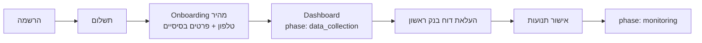
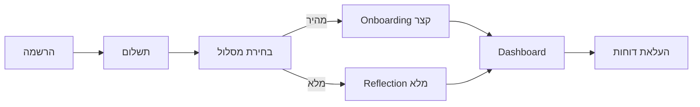
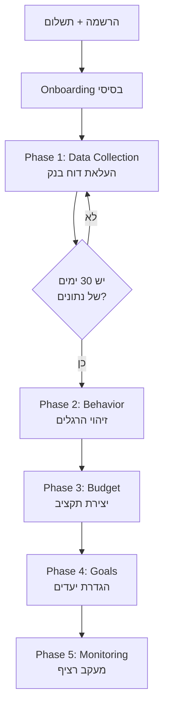

# 🗺️ מפת מסע לקוח מלאה - Phi (φ)

## 📊 תרשים Mermaid - מסע מקצה לקצה

```mermaid
flowchart TD
    Start([🏠 דף נחיתה<br/>Landing Page]) --> Auth{משתמש<br/>מחובר?}
    
    Auth -->|לא| Login[🔐 התחברות/הרשמה<br/>Login/Signup<br/>Google OAuth]
    Auth -->|כן| CheckUser{קיים ב-DB?}
    
    Login --> CheckUser
    
    CheckUser -->|לא| Onboarding[📝 בחירת מסלול<br/>Onboarding Selector]
    CheckUser -->|כן| CheckSub{מנוי פעיל?}
    
    Onboarding --> PlanChoice{בחירת תוכנית}
    PlanChoice --> Payment[💳 תשלום<br/>Payment Page<br/>Basic ₪49 / Premium ₪119]
    
    Payment --> CreateUser[יצירת רשומה ב-users<br/>subscription_status: active]
    CreateUser --> OnboardingSteps[📋 Onboarding Wizard<br/>6 שלבים]
    
    OnboardingSteps --> Step1[1️⃣ בחירת תוכנית]
    Step1 --> Step2[2️⃣ אישור תשלום]
    Step2 --> Step3[3️⃣ טלפון + WhatsApp]
    Step3 --> Step4[4️⃣ פרטים אישיים]
    Step4 --> Step5[5️⃣ משפחה]
    Step5 --> Step6[6️⃣ סיום]
    
    Step6 --> SetPhase[עדכון phase:<br/>data_collection]
    SetPhase --> Dashboard
    
    CheckSub -->|לא| Payment
    CheckSub -->|כן| CheckPhase{מה ה-phase?}
    
    CheckPhase -->|reflection| ReflectionDash[📊 Dashboard<br/>OnboardingDashboard<br/>phase: reflection]
    CheckPhase -->|data_collection| DataDash[📊 Dashboard<br/>FullDashboard<br/>phase: data_collection]
    CheckPhase -->|behavior| BehaviorDash[📊 Dashboard<br/>BehaviorDashboard<br/>phase: behavior]
    CheckPhase -->|budget| BudgetDash[📊 Dashboard<br/>BudgetDashboard<br/>phase: budget]
    CheckPhase -->|goals| GoalsDash[📊 Dashboard<br/>GoalsDashboard<br/>phase: goals]
    CheckPhase -->|monitoring| MonitoringDash[📊 Dashboard<br/>FullDashboard<br/>phase: monitoring]
    
    ReflectionDash --> ReflectionPage[🔄 Reflection Wizard<br/>6 שלבי רפלקציה]
    ReflectionPage --> R1[1️⃣ פרטים אישיים]
    R1 --> R2[2️⃣ הכנסות]
    R2 --> R3[3️⃣ הוצאות קבועות]
    R3 --> R4[4️⃣ חובות ונכסים]
    R4 --> R5[5️⃣ היסטוריה]
    R5 --> R6[6️⃣ יעדים]
    R6 --> CompleteReflection[עדכון phase:<br/>data_collection]
    
    CompleteReflection --> Dashboard[📊 Dashboard מלא<br/>FullDashboard]
    DataDash --> Dashboard
    BehaviorDash --> Dashboard
    BudgetDash --> Dashboard
    GoalsDash --> Dashboard
    MonitoringDash --> Dashboard
    
    Dashboard --> ScanCenter[📸 Scan Center<br/>העלאת דוחות]
    Dashboard --> MissingDocs[📋 Missing Documents<br/>Widget + Page]
    Dashboard --> PendingExpenses[✅ Pending Expenses<br/>אישור תנועות]
    Dashboard --> Reports[📈 דוחות וגרפים]
    Dashboard --> Settings[⚙️ הגדרות]
    
    ScanCenter --> BankCheck{יש דוח בנק?}
    BankCheck -->|לא| BankOnly[🔒 רק דוח בנק זמין]
    BankCheck -->|כן| AllDocs[✅ כל סוגי הדוחות זמינים]
    
    BankOnly --> UploadBank[העלאת דוח בנק]
    AllDocs --> UploadAny[העלאת כל דוח]
    
    UploadBank --> ProcessDoc[⚙️ AI Processing<br/>GPT-5.1 / GPT-4o]
    UploadAny --> ProcessDoc
    
    ProcessDoc --> DetectType{זיהוי סוג דוח}
    DetectType -->|בנק| BankFlow[תהליך דוח בנק]
    DetectType -->|אשראי| CreditFlow[תהליך אשראי]
    DetectType -->|תלוש| PayslipFlow[תהליך תלוש]
    DetectType -->|הלוואה| LoanFlow[תהליך הלוואה]
    DetectType -->|ביטוח| InsuranceFlow[תהליך ביטוח]
    
    BankFlow --> ExtractTx[חילוץ תנועות]
    ExtractTx --> DetectMissing[זיהוי מסמכים חסרים]
    DetectMissing --> SaveSnapshot[שמירת snapshot חשבון]
    SaveSnapshot --> CreatePending[יצירת תנועות ממתינות<br/>status: proposed]
    
    CreditFlow --> MatchBank[התאמה לדוח בנק]
    PayslipFlow --> MatchBank
    LoanFlow --> MatchBank
    InsuranceFlow --> MatchBank
    
    MatchBank --> CreatePending
    CreatePending --> PendingExpenses
    
    PendingExpenses --> UserApprove{משתמש מאשר?}
    UserApprove -->|כן| ConfirmTx[status: confirmed]
    UserApprove -->|לא| RejectTx[status: rejected]
    
    ConfirmTx --> UpdateDash[עדכון Dashboard]
    UpdateDash --> PhiScore[חישוב ציון φ<br/>0-100]
    
    MissingDocs --> RequestDoc[בקשת דוח חסר]
    RequestDoc --> ScanCenter
    
    style Start fill:#8FBCBB
    style Dashboard fill:#A96B48
    style PhiScore fill:#D08770
    style Payment fill:#D08770
    style ProcessDoc fill:#5E81AC
    style PendingExpenses fill:#EBCB8B
```

## 🔍 הבעיות שזיהיתי:

### 1. **שלב Reflection לא קיים ב-Onboarding הרגיל** ❌
- ב-`OnboardingSelector` (6 שלבים) אין שלב reflection
- שלב reflection קיים רק כ-**דף נפרד** (`/reflection`)
- המשתמש מגיע ל-`phase: data_collection` ישירות אחרי onboarding
- אבל ה-Dashboard בודק `phase === 'reflection'` ומציג `OnboardingDashboard`

### 2. **2 מסלולי Onboarding שונים** 🔀
- **מסלול 1:** `OnboardingSelector` (6 שלבים) → `phase: data_collection`
- **מסלול 2:** `reflection` page (6 שלבי reflection) → `phase: data_collection`
- אין בחירה ברורה איזה מסלול לקחת

### 3. **Phase Progression לא ברור** 🤔
- יש 6 phases: `reflection`, `data_collection`, `behavior`, `budget`, `goals`, `monitoring`
- אבל אין לוגיקה ברורה מתי עוברים מ-phase ל-phase
- Dashboard מציג דשבורדים שונים לכל phase אבל אין מנגנון התקדמות

### 4. **Scan Center Logic מבולגן** 📸
- יש בדיקה אם קיים דוח בנק (`hasBankStatement`)
- אבל המשתמש יכול להעלות דוחות גם בלי דוח בנק (אם יש `requiredDocId`)
- הלוגיקה של "guided upload" לא מיושמת עד הסוף

### 5. **Missing Documents System חדש** 🆕
- זה נוסף לאחרונה ועובד טוב
- אבל לא משולב במסע הכללי

## ✅ המלצות לתיקון:

### אופציה 1: מסלול אחיד פשוט

### אופציה 2: מסלול עם Reflection

### אופציה 3: Progressive Phases (מומלץ)

## 🎯 מה צריך להחליט:

1. **האם צריך Reflection בכלל?**
   - אם כן - מתי? בהתחלה או אחרי איסוף נתונים?
   - אם לא - למחוק את הדף והקומפוננטות

2. **איך עוברים בין Phases?**
   - אוטומטי לפי כמות נתונים?
   - ידני עם כפתור "המשך לשלב הבא"?
   - לפי זמן (7 ימים בכל phase)?

3. **מה התפקיד של Scan Center?**
   - רק דוח בנק בהתחלה?
   - כל הדוחות מהיום הראשון?
   - Guided upload עם Missing Documents?

## 📝 הצעה קונקרטית:

אני ממליץ על **מסלול פשוט ומובנה**:

1. **הרשמה** → Google OAuth
2. **תשלום** → בחירת תוכנית (Basic/Premium)
3. **Onboarding מהיר** → טלפון + WhatsApp + פרטים בסיסיים (3 דקות)
4. **Dashboard** → phase: `data_collection`
5. **העלאת דוח בנק ראשון** → חובה, נעול עד שמעלים
6. **אישור תנועות** → כל התנועות ממתינות לאישור
7. **Missing Documents** → המערכת מבקשת דוחות נוספים
8. **Phase Progression** → אוטומטי לפי כמות נתונים:
   - `data_collection` → עד 30 ימים של נתונים
   - `behavior` → 30-60 ימים (זיהוי הרגלים)
   - `budget` → 60-90 ימים (יצירת תקציב)
   - `goals` → 90+ ימים (הגדרת יעדים)
   - `monitoring` → לצמיתות (מעקב רציף)

רוצה שאממש את זה?

