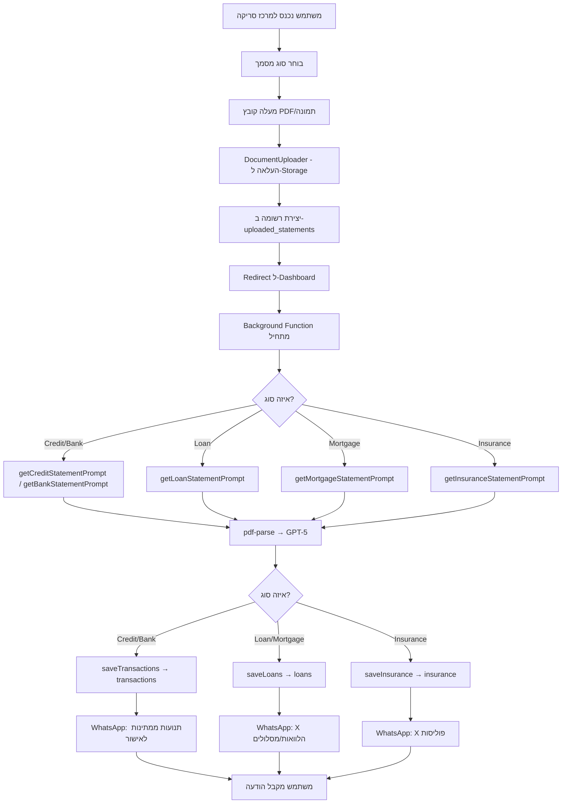

# 📄 מערכת עיבוד מסמכים מלאה - FinHealer

**תאריך:** 29 אוקטובר 2025

---

## 🎯 **סיכום המערכת**

בנינו מערכת OCR מלאה לעיבוד 5 סוגי מסמכים פיננסיים עם AI:

| # | סוג מסמך | טבלת יעד | מה מחלצים | זמן ממוצע |
|---|----------|----------|-----------|------------|
| 1️⃣ | **דוח אשראי** 💳 | `transactions` | 100-200 עסקאות | ~4-5 דק |
| 2️⃣ | **דוח בנק** 🏦 | `transactions` | הכנסות, הוצאות, הלוואות | ~4 דק |
| 3️⃣ | **דוח הלוואות** 💰 | `loans` | פרטי הלוואות רגילות | ~20-30 שניות |
| 4️⃣ | **דוח משכנתא** 🏠 | `loans` | מסלולים (כל מסלול = הלוואה) | ~2 דק |
| 5️⃣ | **דוח ביטוחים** 🛡️ | `insurance` | פוליסות מ"הר הביטוח" | ~80 שניות |

---

## ✅ **מה הושלם**

### 1. **קובץ פרומפטים** (`lib/ai/document-prompts.ts`)
- ✅ 5 פרומפטים מותאמים אישית לכל סוג מסמך
- ✅ פרומפט חכם לדוח אשראי (עברית + אנגלית, כל סוגי העסקאות)
- ✅ פרומפט חכם לדוח בנק (הפרדה בין income/expense/loan_payment/savings)
- ✅ פרומפט מדויק לדוח הלוואות רגיל
- ✅ פרומפט מדויק לדוח משכנתא (מסלולים)
- ✅ פרומפט מדויק לדוח ביטוחים ("הר הביטוח")
- ✅ פונקציית עזר `getPromptForDocumentType()` לבחירה אוטומטית

### 2. **עיבוד מסמכים** (`app/api/documents/process/route.ts`)
- ✅ `analyzePDFWithAI()` - חילוץ טקסט + ניתוח עם GPT-5
- ✅ `analyzeImageWithAI()` - ניתוח תמונות עם GPT-5
- ✅ `saveTransactions()` - שמירת דוחות אשראי/בנק
  - תמיכה בשני פורמטים: `{ transactions: [...] }` ו-`{ transactions: { income, expenses, ... } }`
  - המרת תאריכים מ-DD/MM/YYYY ל-YYYY-MM-DD
  - מיפוי סוגי הוצאות (רגיל/תשלום/קרדיט/הוראת קבע)
- ✅ `saveLoans()` - שמירת דוחות הלוואות/משכנתא
  - תמיכה בהלוואות רגילות: `{ loans: [...] }`
  - תמיכה במשכנתא: `{ tracks: [...] }` (כל מסלול = הלוואה נפרדת)
  - חישוב `remaining_months` מתוך `remaining_payments`
  - שמירת מטא-דאטה מקורי ב-`metadata`
- ✅ `saveInsurance()` - שמירת דוחות ביטוח
  - המרת תקופות לתאריכים
  - מיפוי סוגי ביטוח לפי `main_branch`
  - הפרדה בין פרמיה חודשית/שנתית
  - שמירת פרטים מלאים ב-`coverage_details`
- ✅ `sendWhatsAppNotification()` - הודעות WhatsApp מותאמות לכל סוג מסמך

### 3. **ממשק משתמש**
- ✅ `DocumentUploader` תומך ב-10 סוגי מסמכים
- ✅ `/dashboard/scan-center` - מרכז סריקה עם 9 כרטיסי מסמך
- ✅ העלאה מיידית + עיבוד ברקע
- ✅ Redirect ל-dashboard אחרי העלאה מוצלחת

### 4. **מבנה נתונים**
- ✅ טבלת `transactions` - מוכנה לכל השדות
- ✅ טבלת `loans` - מוכנה עם `metadata` JSONB
- ✅ טבלת `insurance` - מוכנה עם `coverage_details` JSONB
- ✅ כל השדות הנחלצים ממופים לטבלאות
- ✅ שדות נוספים נשמרים ב-`metadata`

### 5. **בדיקות**
- ✅ נבדק על דוח אשראי אמיתי (152 עסקאות)
- ✅ נבדק על דוח בנק אמיתי (הכנסות + הוצאות)
- ✅ נבדק על דוח הלוואות אמיתי (2 הלוואות)
- ✅ נבדק על דוח משכנתא אמיתי (6 מסלולים)
- ✅ נבדק על דוח ביטוחים אמיתי (11 פוליסות)

---

## 🔄 **תהליך עיבוד מלא**



---

## 📊 **דוגמאות פלט**

### דוח אשראי
```json
{
  "transactions": [
    {
      "date": "21/08/2025",
      "vendor": "שפירא גז",
      "amount": 920.00,
      "category": "גז",
      "type": "תשלום",
      "installment": "תשלום 1 מ-2"
    }
  ]
}
```

### דוח בנק
```json
{
  "account_info": {
    "from_date": "01/10/2025",
    "to_date": "31/10/2025",
    "opening_balance": 15000.00,
    "closing_balance": 12000.00
  },
  "transactions": {
    "income": [...],
    "expenses": [...],
    "loan_payments": [...],
    "savings_transfers": [...]
  }
}
```

### דוח משכנתא
```json
{
  "report_info": {
    "total_debt": 1770000.00
  },
  "tracks": [
    {
      "track_number": "1",
      "track_type": "קבועה לא צמודה",
      "original_amount": 500000.00,
      "current_balance": 450000.00,
      "interest_rate": 2.5,
      "monthly_payment": 2000.00
    }
  ]
}
```

### דוח ביטוחים
```json
{
  "insurance_policies": [
    {
      "domain": "כללי",
      "main_branch": "ביטוח דירה",
      "insurance_company": "איי.די.איי.",
      "premium_amount": 4554.00,
      "premium_type": "שנתית"
    }
  ]
}
```

---

## 📝 **מה נשאר לעשות**

### 1. **UI למסמכים שעובדו** (Priority: HIGH)
- [ ] דף `/dashboard/data/loans` - הצגת הלוואות ומשכנתאות
- [ ] דף `/dashboard/data/insurance` - הצגת ביטוחים
- [ ] עריכה ומחיקה של הלוואות/ביטוחים
- [ ] גרפים ותובנות (התקדמות הלוואה, סה"כ פרמיות וכו')

### 2. **בדיקות נוספות** (Priority: MEDIUM)
- [ ] בדיקה עם קבצים מפגומים
- [ ] בדיקה עם דוחות מבנקים שונים
- [ ] בדיקה עם דוחות ארוכים מאוד (500+ עסקאות)
- [ ] בדיקה עם תמונות לא ברורות

### 3. **שיפורים** (Priority: LOW)
- [ ] תמיכה ב-Excel (XLSX/XLS)
- [ ] תמיכה בדוחות השקעות
- [ ] תמיכה בתלושי משכורת
- [ ] תמיכה בדוחות פנסיה
- [ ] OCR מקומי (Tesseract) כ-fallback

### 4. **אופטימיזציה** (Priority: LOW)
- [ ] Cache של מסמכים שכבר עובדו
- [ ] דחיסת תמונות לפני שליחה ל-GPT-5
- [ ] שימוש ב-GPT-5-nano לדוחות פשוטים
- [ ] Batch processing של מסמכים מרובים

---

## 🛠️ **קבצים שנוצרו/עודכנו**

### קבצים חדשים
1. `lib/ai/document-prompts.ts` - 5 פרומפטים מותאמים
2. `DOCUMENT_ANALYSIS_FIELDS.md` - מפת שדות
3. `DOCUMENT_PROCESSING_SYSTEM.md` - תיעוד זה

### קבצים שעודכנו
1. `app/api/documents/process/route.ts` - לוגיקה מלאה
2. `app/api/documents/upload/route.ts` - תמיכה במשכנתא
3. `components/shared/DocumentUploader.tsx` - תמיכה במשכנתא
4. `app/dashboard/scan-center/page.tsx` - כרטיס משכנתא

### קבצים זמניים שנשמרו
- `test-extracted-text.txt` - דוגמת טקסט מחולץ (לבקשת המשתמש)

---

## 💡 **טיפים לשימוש**

### כיצד להוסיף סוג מסמך חדש?

1. **הוסף פרומפט חדש** ב-`lib/ai/document-prompts.ts`:
```typescript
export function getNewDocumentPrompt(text: string): string {
  return `...`;
}
```

2. **עדכן את `getPromptForDocumentType()`**:
```typescript
if (normalizedType.includes('new_type')) {
  return getNewDocumentPrompt(extractedText);
}
```

3. **צור פונקציית save חדשה** ב-`process/route.ts`:
```typescript
async function saveNewDocuments(supabase, result, userId, documentId) {
  // Logic to save to new table
}
```

4. **עדכן את הלוגיקה הראשית**:
```typescript
if (docType.includes('new_type')) {
  itemsProcessed = await saveNewDocuments(supabase, result, stmt.user_id, statementId);
}
```

5. **הוסף כרטיס ב-scan-center**:
```typescript
{
  type: 'new_type',
  title: 'סוג מסמך חדש',
  description: '...',
  icon: NewIcon,
  color: 'bg-...',
}
```

---

## 🎉 **סיכום**

המערכת מוכנה לעיבוד מלא של 5 סוגי מסמכים פיננסיים!

**מה עובד עכשיו:**
- ✅ העלאת מסמכים
- ✅ חילוץ טקסט מ-PDF
- ✅ ניתוח חכם עם GPT-5
- ✅ שמירה בטבלאות הנכונות
- ✅ הודעות WhatsApp מותאמות

**מה צריך להוסיף:**
- 📊 UI להצגת הלוואות וביטוחים
- 🧪 בדיקות נוספות
- 🚀 אופטימיזציות

---

**נבנה על ידי:** AI Assistant  
**תאריך:** 29 אוקטובר 2025  
**גרסה:** 1.0

