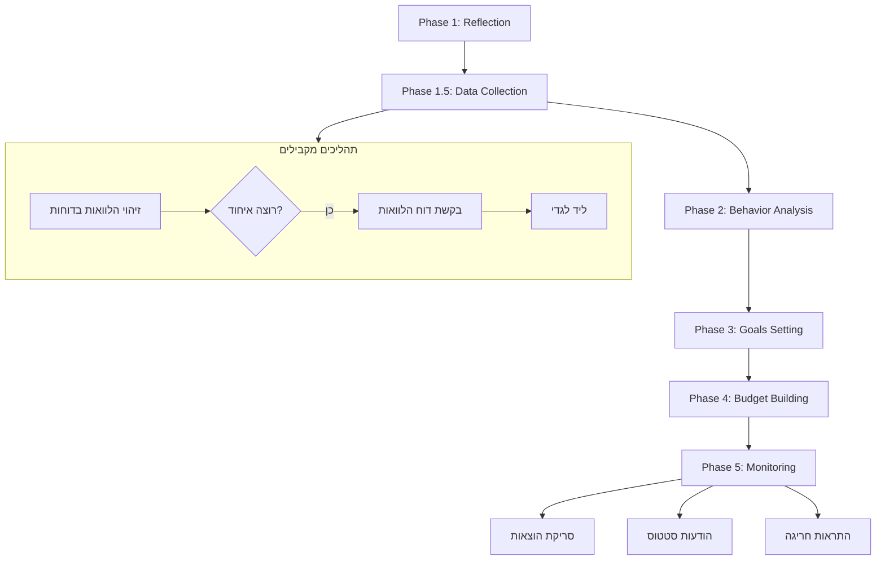

# 🎯 מסלול φ (Phi) - הסדר הנכון!

**תאריך עדכון:** 31 דצמבר 2025  
**מקור:** פגישה עם גדי

---

## ✅ **המסלול הנכון של φ (Phi):**

```
Phase 1: Reflection        → שיקוף העבר (איסוף נתונים היסטוריים)
Phase 1.5: Data Collection → העלאת מסמכים (דוחות בנק/אשראי/תלושים)
Phase 2: Behavior          → ניתוח דפוסים (AI מזהה הרגלים)
Phase 3: Goals             → הגדרת יעדים יחד עם הלקוח 🆕
Phase 4: Budget            → בניית תקציב חכם מבוסס יעדים 🆕
Phase 5: Monitoring        → מעקב שוטף (התראות, תובנות, עצות)
```

**⚠️ שינוי חשוב:** יעדים לפני תקציב! צריך לדעת את היעדים כדי לבנות תקציב שתומך בהם.

---

## 📊 פרמטרים לבניית תקציב (מפגישה עם גדי)

### ארבעת המרכיבים:

| פרמטר | הסבר | מקור |
|-------|------|------|
| **ממוצע שורת הוצאה** | לפי שורה ספציפית (לא קטגוריה) | transactions |
| **ממוצע חודשי** | חישוב מתוך 12 חודשים | transactions |
| **יעד** | נקבע יחד עם הלקוח | goals |
| **המלצה** | של גדי/AI | AI analysis |

### דוגמה:
```
שורת הוצאה: "תקשורת"
├── ממוצע שורה: 350 ₪ (מממוצע כל התנועות בקטגוריה)
├── ממוצע חודשי: 320 ₪ (מתוך 12 חודשים)
├── יעד לקוח: 280 ₪
└── המלצת גדי: 300 ₪ (כי יש חבילה טובה יותר)
```

---

## 🛡️ שני סוגי רשתות ביטחון

### 1. ביטחון פיננסי
- קרן חירום (3-6 חודשי הוצאות)
- חיסכון נזיל
- גיבוי לאירועים בלתי צפויים

### 2. ביטחון ביטוחי
- ביטוח חיים
- ביטוח בריאות
- ביטוח אובדן כושר עבודה
- ביטוח דירה/רכב

---

## 🎯 סוגי יעדים

### יעד מכוון (ספציפי)
- סכום מוגדר + תאריך יעד
- דוגמאות: רכב 80,000₪ בעוד שנתיים, חופשה 15,000₪ בעוד 6 חודשים

### יעד כללי (כיווני)
- שיפור מצב פיננסי
- הקטנת חובות
- הגדלת חיסכון

---

## 📐 גורמים לבניית תקציב נכון

התקציב הנכון נבנה **ביחס** לפרמטרים הבאים:

| פקטור | משפיע על |
|-------|----------|
| **מספר נפשות** | גודל משפחה, הוצאות per capita |
| **סוג מגורים** | שכירות/בעלות, גודל, מיקום |
| **רמת הכנסה** | כמה נכנס, יציבות הכנסה |
| **גובה התחייבויות** | הלוואות, משכנתא, ליסינג |
| **הוצאות משתנות** | התנהלות שוטפת, דפוסי צריכה |
| **הוצאות קבועות** | שאינן התחייבויות (ביטוחים, מנויים) |
| **הוצאות מיוחדות** | אירועים, קניות גדולות |

---

## 🔄 הזרימה המלאה



---

## 📊 Phase 1: Reflection - שיקוף העבר

### מטרה:
להבין את ההרגלים הפיננסיים של הלקוח **לפני** שבונים לו תקציב.

### מה הבוט שואל:
- הוצאות ממוצעות לפי קטגוריות
- תחושות לגבי המצב הפיננסי
- מטרות ראשוניות

### שמירה:
**טבלה:** `user_baselines`

---

## 📂 Phase 1.5: Data Collection - העלאת מסמכים

### מסמכים נדרשים:
- 🏦 דוחות בנק (3-6 חודשים)
- 💳 דוחות אשראי
- 📄 תלושי משכורת
- 🏡 דוחות משכנתא/הלוואות
- 🛡️ פוליסות ביטוח
- 📊 דוחות פנסיה

### תהליך:
1. משתמש שולח PDF ב-WhatsApp
2. AI מנתח ומפרק אוטומטית
3. תנועות נשמרות ב-`transactions`
4. סיווג הכנסות/הוצאות

---

## 🧠 Phase 2: Behavior - ניתוח דפוסים

### AI מזהה:
- 🔄 הוצאות חוזרות (subscriptions, חשבונות קבועים)
- 📈 מגמות (עלייה/ירידה בקטגוריות)
- ⚠️ חריגות (הוצאות חד-פעמיות גבוהות)
- 💡 הזדמנויות חיסכון

### שמירה:
- `behavior_insights` - תובנות
- `user_patterns` - דפוסים
- `recurring_patterns` - הוצאות קבועות

---

## 🎯 Phase 3: Goals - הגדרת יעדים (חדש!)

### 🆕 **יעדים לפני תקציב!**

### תהליך:
```
Bot: 🎯 עכשיו בוא נגדיר יחד את היעדים שלך!
     
     מה המטרות שלך? הנה כמה דוגמאות:
     
     💰 חיסכון:
     • קרן חירום
     • חיסכון לילדים
     • פנסיה
     
     🎁 רכישות:
     • רכב חדש
     • דירה / מקדמה
     • שיפוץ
     
     ✈️ חוויות:
     • חופשה משפחתית
     • אירוע (חתונה, בר מצווה)
     
     💳 הפחתת חובות:
     • סגירת הלוואות
     • הקטנת מינוס

User: רכב חדש בעוד שנתיים

Bot: מעולה! 🚗
     
     כמה צריך לרכב?

User: 80000

Bot: אוקיי! 80,000 ₪ בעוד 24 חודשים = 3,333 ₪ לחודש.
     
     נבדוק אם זה ריאלי בשלב התקציב! 
     
     יש עוד יעדים שתרצה להוסיף?
```

### שמירה:
**טבלה:** `goals`
```sql
goals {
  user_id,
  name: "רכב חדש",
  target_amount: 80000,
  deadline: '2026-12-31',
  priority: 1,
  status: 'active'
}
```

---

## 💰 Phase 4: Budget - בניית תקציב חכם

### 🆕 **תקציב מבוסס יעדים!**

### תהליך AI:
```typescript
// 1. אסוף נתונים
const income = getTotalIncome(userId);
const fixedExpenses = getFixedExpenses(userId);
const goals = getUserGoals(userId);
const behavior = getBehaviorInsights(userId);

// 2. חשב תקציב זמין
const availableBudget = income - fixedExpenses;

// 3. הקצה ליעדים קודם!
const goalsAllocation = calculateGoalsAllocation(goals, availableBudget);

// 4. בנה תקציב משתנה מהשאר
const variableBudget = availableBudget - goalsAllocation.total;

// 5. AI ממליץ חלוקה
const recommendedBudget = AI.buildSmartBudget({
  availableBudget: variableBudget,
  historicalSpending: behavior,
  numberOfPeople: getUserProfile(userId).family_size,
  residenceType: getUserProfile(userId).residence_type,
  goals: goalsAllocation
});
```

### הצגה ללקוח:
```
Bot: ✨ הנה התקציב המותאם ליעדים שלך!

     📊 סיכום חודשי:
     
     💵 הכנסות: 15,000 ₪
     
     🔒 הוצאות קבועות: 5,000 ₪
        • משכנתא: 3,000 ₪
        • ביטוחים: 800 ₪
        • תקשורת: 400 ₪
        • מנויים: 300 ₪
        • חשבונות: 500 ₪
     
     🎯 הקצאה ליעדים: 3,333 ₪
        • רכב חדש: 3,333 ₪
     
     💳 הוצאות משתנות: 6,667 ₪
        • מזון: 2,500 ₪ (המלצה: 2,200₪)
        • תחבורה: 1,200 ₪
        • בילויים: 1,000 ₪
        • קניות: 800 ₪
        • בריאות: 500 ₪
        • אחר: 667 ₪
     
     💡 הערת גדי:
     אתה מוציא יותר מדי על מזון בחוץ.
     אם תקטין ב-300₪ תגיע ליעד מהר יותר!
```

---

## 📈 Phase 5: Monitoring - מעקב

### פעולות נדרשות מהלקוח:
- ✅ סריקת הוצאות (קבלות, תנועות)
- ✅ אישור תנועות מוצעות

### הודעות יוצאות:
- 📊 סיכום שבועי (כל יום ראשון)
- ⚠️ התראות חריגה (בזמן אמת)
- 🎉 עדכוני התקדמות ליעדים
- 💡 טיפים מותאמים

---

## 🔄 תהליך מקביל: איחוד הלוואות

### זיהוי אוטומטי:
כשמזהים הלוואות בדוחות הבנק:

```
Bot: 💳 זיהיתי כמה הלוואות:
     
     • הלוואה בנקאית: 1,200 ₪/חודש (עוד 36 תשלומים)
     • הלוואת רכב: 800 ₪/חודש (עוד 24 תשלומים)
     • כרטיס אשראי: 500 ₪/חודש (יתרה: 8,000 ₪)
     
     סה"כ: 2,500 ₪/חודש
     
     💡 אפשר שגדי יבדוק אפשרות לאיחוד?
     זה יכול לחסוך לך כסף!

User: כן

Bot: מעולה! 
     
     בשביל לבדוק צריך דוח הלוואות מהבנק.
     תוכל להעלות אותו?
     
     [דוח הלוואות מהבנק]

User: *מעלה קובץ*

Bot: קיבלתי! 📄
     
     העברתי לגדי את הפרטים:
     • דוח הלוואות
     • סיכום התנועות שלך
     • המלצות ראשוניות
     
     גדי יחזור אליך עם הצעה תוך 48 שעות! 📞
```

---

## 📋 סיכום השלבים

| שלב | שם | מטרה | סטטוס |
|-----|-----|------|-------|
| 1 | Reflection | שיקוף עבר | ✅ מוכן |
| 1.5 | Data Collection | העלאת מסמכים | ✅ מוכן |
| 2 | Behavior | ניתוח דפוסים | ✅ מוכן |
| 3 | Goals | הגדרת יעדים | 🚀 הבא |
| 4 | Budget | בניית תקציב | ⏳ ממתין |
| 5 | Monitoring | מעקב שוטף | ⏳ ממתין |

---

## 💡 עקרונות מפתח

### 1. יעדים לפני תקציב
> "צריך לדעת לאן הולכים לפני שמתכננים את הדרך"

### 2. תקציב מבוסס נתונים
- ממוצע שורת הוצאה
- ממוצע חודשי
- יעד לקוח
- המלצת גדי

### 3. שני סוגי ביטחון
- פיננסי (קרן חירום)
- ביטוחי (כיסוי מלא)

### 4. תקציב ביחס ל...
- מספר נפשות
- סוג מגורים
- רמת הכנסה
- גובה התחייבויות
- התנהלות שוטפת

---

**עדכון אחרון:** 31 דצמבר 2025 - עדכון לפי פגישה עם גדי
