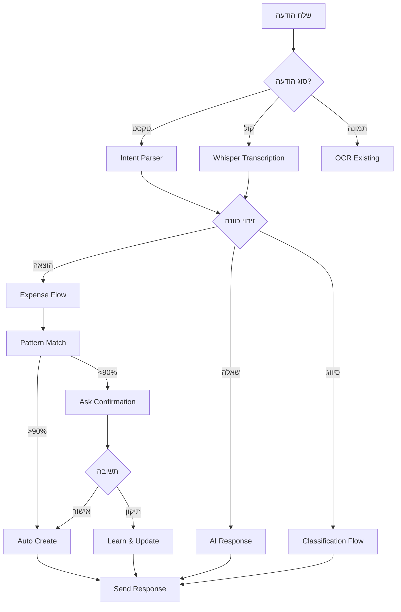

# 🚀 WhatsApp AI Quickstart Guide

## התחלה מהירה - 5 דקות ⚡

### 1. הגדר משתני סביבה (.env.local)

```env
# OpenAI (required)
OPENAI_API_KEY=sk-proj-...

# Cron Protection (optional but recommended)
CRON_SECRET=random-secret-here-change-this

# GreenAPI (existing)
GREEN_API_INSTANCE_ID=your-instance
GREEN_API_TOKEN=your-token
```

### 2. הרץ Migration

```bash
# Apply the WhatsApp AI database schema
supabase db push

# או בצורה ידנית:
# העתק את התוכן של:
# supabase/migrations/20251124_whatsapp_ai_system.sql
# והרץ ב-Supabase SQL Editor
```

### 3. Deploy ל-Vercel

```bash
vercel deploy --prod
```

### 4. הגדר Cron Secret ב-Vercel

```bash
vercel env add CRON_SECRET
# הכנס את אותו secret מ-.env.local
```

### 5. בדיקה - שלח הודעה בWhatsApp!

```
"קניתי קפה 28 שקל"
```

הבוט אמור להגיב:
```
רשמתי 28 ₪ על קפה. נכון?
```

---

## 🧪 בדיקות נוספות

### Test 1: הודעת קול
שלח הודעת קול בוואטסאפ: "קניתי קפה עשרים ושמונה שקל"

הבוט יתמלל ויגיב!

### Test 2: סיווג תנועות
העלה קובץ בנק או אמור:
```
"יש לי 20 תנועות חדשות"
```

הבוט ישאל שאלות בזו אחר זו.

### Test 3: תובנות פרואקטיביות
```bash
curl -X POST https://your-domain.com/api/cron/reminders \
  -H "Content-Type: application/json" \
  -H "Authorization: Bearer YOUR_CRON_SECRET" \
  -d '{"action": "test_insights", "userId": "your-user-id"}'
```

---

## 🎯 תכונות עיקריות

| תכונה | דוגמה | סטטוס |
|---|---|---|
| רישום הוצאות | "50 שקל קפה" | ✅ |
| הודעות קול | 🎤 + Whisper | ✅ |
| סיווג אוטומטי | למד מדפוסים | ✅ |
| תיקון חכם | "לא זה לא קפה זה ארוחה" | ✅ |
| הפסקות חכמות | לא להתיש | ✅ |
| תובנות | "הוצאות מזון +30%" | ✅ |
| תזכורות | משכורת/חשבונות | ✅ |
| קישור מסמכים | אשראי ↔ בנק | ✅ |

---

## 📱 זרימת משתמש טיפוסית



---

## 🔧 Troubleshooting

### בעיה: הבוט לא משיב
1. בדוק ש-`wa_opt_in = true` למשתמש
2. ודא ש-`phone` מנורמל (972XXXXXXXXX)
3. בדוק logs ב-Vercel

### בעיה: Cron לא רץ
1. ודא ש-`CRON_SECRET` מוגדר ב-Vercel
2. בדוק `vercel.json` → `crons` array
3. חכה 15 דקות - זה לוקח זמן

### בעיה: הודעות קול לא עובדות
1. ודא ש-`OPENAI_API_KEY` תקין
2. בדוק שה-URL של הקול נגיש
3. GreenAPI צריך לתמוך בהורדת קבצים

---

## 🎨 התאמה אישית

### שינוי אישיות הבוט
ערוך: `lib/ai/prompts/phi-coach-system.ts`

```typescript
export const PHI_COACH_SYSTEM_PROMPT = `אתה φ (פאי)...
// כאן תוכל לשנות את האישיות, הסגנון, הטון
`;
```

### שינוי סף אוטו-קטגוריזציה
```sql
UPDATE user_preferences
SET auto_categorize_threshold = 0.9  -- רק >90%
WHERE user_id = 'user-id';
```

### השבתת תובנות פרואקטיביות
```sql
UPDATE user_preferences
SET proactive_insights_enabled = FALSE
WHERE user_id = 'user-id';
```

---

## 📊 מדדי הצלחה

עקוב אחרי:
- **Conversation Completion Rate**: % סיווגים שהושלמו
- **Auto-categorization Accuracy**: % נכון מהמסווג אוטומטית
- **User Corrections**: מעט יותר טוב
- **Response Time**: < 2 שניות
- **Pattern Learning**: דפוסים חדשים לכל משתמש

---

## 🚨 אבטחה

1. **RLS מופעל** על כל הטבלאות החדשות
2. **CRON_SECRET** להגנה על endpoints
3. **Rate Limiting**: 100 הודעות/יום למשתמש
4. **Webhook Verification**: (אופציונלי) מ-GreenAPI

---

## 💬 דוגמאות שיחה

### דוגמה 1: רישום פשוט
```
👤: "50 שקל קפה"
🤖: "רשמתי 50 ₪ על קפה. נכון?"

👤: "כן"
🤖: "נרשם! 💚"
```

### דוגמה 2: תיקון
```
👤: "קניתי משהו 100 שקל"
🤖: "רשמתי 100 ₪. מה זה?"

👤: "סופר"
🤖: "מעולה! נרשם במזון 🛒"

👤: "לא לא זה היה בגדים"
🤖: "אוקיי תיקנתי לבגדים ✓"
```

### דוגמה 3: הפסקה
```
🤖: "מצאתי 47 תנועות. יש לי כמה שאלות. בא לך?"

👤: "אחר כך"
🤖: "בסדר גמור! מתי להזכיר לך? מחר בבוקר?"

👤: "כן"
🤖: "סבבה, אזכיר לך מחר ב-9:00 😊"
```

---

## 📚 מסמכים נוספים

- [WHATSAPP_AI_IMPLEMENTATION.md](./WHATSAPP_AI_IMPLEMENTATION.md) - תיעוד מלא
- [whats.plan.md](./whats.plan.md) - התוכנית המקורית
- [lib/ai/prompts/phi-coach-system.ts](./lib/ai/prompts/phi-coach-system.ts) - אישיות הבוט

---

## ⚡ Quick Commands

```bash
# Local development
npm run dev

# Run migration
supabase db push

# Deploy
vercel deploy --prod

# Check logs
vercel logs

# Test cron
curl https://your-domain.com/api/cron/reminders \
  -H "Authorization: Bearer YOUR_SECRET"
```

---

**🎉 מוכן לשימוש! תתחיל לשלוח הודעות בוואטסאפ והבוט ילמד מההרגלים שלך.**

**Built with φ (Phi) - היחס הזהב של הכסף שלך** 💰✨

